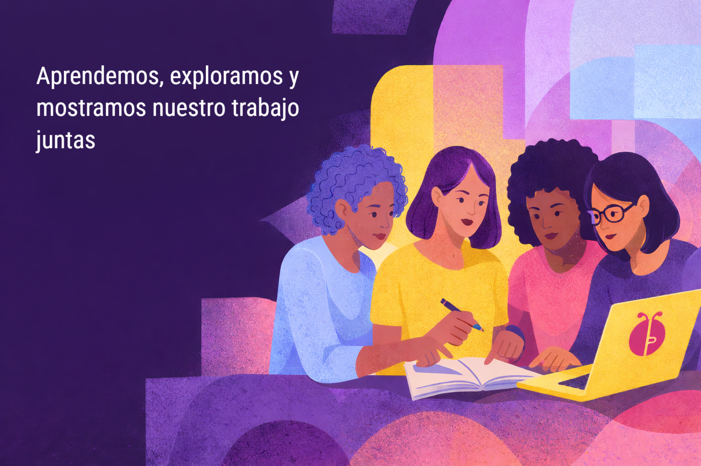

# 🐞 Debug Colectiva

**Debug Colectiva** es una **iniciativa y comunidad** que busca **visibilizar, documentar y fortalecer** el trabajo de mujeres profesionales y estudiantes de **Ciencias Sociales**, especialmente aquellas que desarrollan **investigación aplicada en contextos reales**, desde enfoques **cuantitativos, cualitativos y mixtos**.

Promovemos la visibilidad de procesos que muchas veces quedan detrás de escena, como:
- análisis de datos,
- programación,
- trabajo de campo,
- diseño metodológico,
- investigación cualitativa,
- y producción de conocimiento aplicado.

Lo hacemos usando plataformas tradicionalmente dominadas por perfiles técnicos como **GitHub**, **LinkedIn** y otros espacios digitales abiertos.

Sabemos que no siempre es fácil mostrarse: la falta de tiempo, el miedo al juicio, las dudas sobre el valor de lo que hacemos o las barreras institucionales muchas veces nos empujan al silencio.  
Por eso, **Debug Colectiva no es solo un espacio técnico**: es una **red de cuidado, aprendizaje compartido y visibilidad colectiva**.

Debug Colectiva apuesta por:
- Hacer visible el trabajo que normalmente queda detrás de escena,
- Fomentar una documentación clara y reproducible,
- Y abrir espacios donde el conocimiento en Ciencias Sociales se comparta desde la práctica, el proceso y la experiencia real.
---

## 🧠 ¿Por qué “Debug”?

En programación, *debuguear* es encontrar y corregir errores.  
Para nosotras, **debug también es una metáfora**.

En Debug Colectiva:
- debugueamos inseguridades,
- debugueamos bloqueos técnicos y emocionales,
- debugueamos la idea de que “nuestro trabajo no es suficiente”.

Lo hacemos **juntas**, con paciencia, sin juicio y con mucha complicidad.

---

## 🎯 ¿A quién está dirigida?

Debug Colectiva es para:

- Mujeres de las **Ciencias Sociales** que trabajan con datos, programación, investigación cualitativa o cuantitativa, o que están empezando a hacerlo.  
- Quienes quieren usar **GitHub** para documentar, compartir o publicar su trabajo, pero se han sentido fuera de lugar en espacios técnicos.  
- Quienes dudan si su trabajo “merece” ser mostrado y necesitan un entorno donde **equivocarse sea parte del proceso**.
  
No necesitas saber programar “bien”.  
Necesitas **ganas de aprender y de no hacerlo sola**.

---

## 🧩 Qué hacemos

- Acompañamos a mujeres a **crear y fortalecer portafolios profesionales en GitHub, LinkedIn y otras redes**.  
- Impulsamos el uso de **GitHub** como espacio para **documentar procesos, análisis, investigaciones y proyectos sociales**, no solo código.  
- Promovemos **LinkedIn** como una plataforma clave para **hacer visible el trabajo profesional**, compartir aprendizajes, narrar procesos y construir redes.  
- Generamos espacios de **formación, mentoría y reflexión colectiva**, combinando aprendizaje técnico y acompañamiento humano.  
- Construimos una comunidad donde **mostrar el trabajo es un acto político, de cuidado y de autonomía profesional**.

---

## 🚀 Nuestro programa piloto

**Debug Colectiva** nació como un programa piloto en 2025.

### Resultados de la primera edición
- Más de **40 postulaciones**
- **7 participantes seleccionadas**
- **6** Proyectos publicados o fortalecidos en GitHub
- Mentorías técnicas y espacios de reflexión sobre género, legitimidad y visibilidad profesional

> ✨ Debug Colectiva demostró que la tecnología también puede ser un espacio seguro, humano y colaborativo.

---

## 🌱 Valores de la comunidad

- **Cuidado mutuo y escucha activa**  
  Acompañamos sin juzgar y escuchamos sin imponer.

- **El error como parte del camino**  
  Aquí el error no se esconde: se comparte y se aprende.

- **Validación de lo emocional**  
  El miedo, la duda y la alegría también son parte del proceso técnico.

- **Respeto por los ritmos y contextos**  
  Cada una avanza a su tiempo. Nadie queda atrás.

- **Valor de lo cotidiano**  
  Lo pequeño, lo incompleto y lo imperfecto también cuenta.

- **Autonomía acompañada**  
  Fomentamos independencia técnica, no soledad.

---

## 🧭 Cómo participar

Este es un espacio **abierto, cuidado y sin competencia**.  
Puedes sumarte desde donde estés y con el tiempo que tengas.

- 📩 Escríbenos a nuestro [Linkedin](https://www.linkedin.com/company/debug-colectiva/)
- 📣 Próximamente nuestro programa para universidades públicas. 

---

## 🤝 Equipo

Debug Colectiva es impulsada por mujeres con experiencia en **datos, políticas públicas, investigación, tecnología, gestión cultural y género**.

Actualmente nuestra organización está conformada por:
- [Carolina Saavedra](https://www.linkedin.com/in/carolina-saavedra-pena/)
- [Greta Góngora](https://www.linkedin.com/in/greta-gongora/)
- [Estelita Landa](https://www.linkedin.com/in/estelita-landa-oliva-43167b385/)
- [Rocsana Cubeños](https://www.linkedin.com/in/yeny-rocsana-cube%C3%B1os-l%C3%B3pez-b60315230/)
- [Rosa Rojas](https://www.linkedin.com/in/rosa-angela-rojas-huaman/)
---
Agradecemos a quiénes nos acompañaron en el primer piloto y formaron parte de nuestra historia: [Susana Chang](https://www.linkedin.com/in/susana-chang-97697424/), [Melissa Navarro](https://www.linkedin.com/in/melissanavarroreyes/), [Sarita Cusi](https://www.linkedin.com/in/sarita-cusi-a9ab59139/), [Emily Saavedra](https://www.linkedin.com/in/emily-saave-dra/) y [Lesly Flores](https://www.linkedin.com/in/lesly-flores-008232114/).

## 📚 Recursos

- [Guía introductoria para subir tus proyectos a GitHub](https://github.com/DebugColectiva/Gu-a_Introductoria_GitHub)
- [Guía de Networking por Ioanna Gallo](#)

---

> 💜 *Debug Colectiva es una comunidad donde aprendemos, exploramos y mostramos nuestro trabajo juntas.*  
> **#DebugColectiva #MujeresEnTecnología #CienciasSociales #GitHub #TecnologíaConPropósito**
